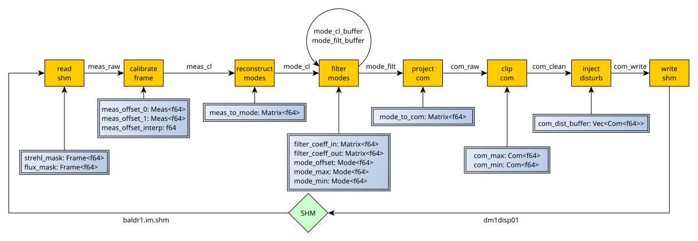

# baldr RTC

Jesse's implementation of the baldr RTC.

## Todo:

- [ ] graceful exit of program (e.g., via commander method)

## RTC Logic

## Compliance

### Data Object Implementation

| Data Object        | Diagram | c-header | servo loop | baldr | config | Commander | supervisor |
| ------------------ | :-----: | :------: | :--------: | :---: | :----: | :-------: | :--------: |
| `meas_offset`      |  :ok:   |   :ok:   |    :ok:    | :ok:  |  :ok:  |   :ok:    |    :ok:    |
| `meas_to_mode`     |  :ok:   |   :ok:   |    :ok:    | :ok:  |  :ok:  |   :ok:    |    :ok:    |
| `filter_coeff_in`  |  :ok:   |   :ok:   |    :ok:    | :ok:  |  :ok:  |   :ok:    |    :ok:    |
| `filter_coeff_out` |  :ok:   |   :ok:   |    :ok:    | :ok:  |  :ok:  |   :ok:    |    :ok:    |
| `mode_offset`      |  :ok:   |   :ok:   |    :ok:    | :ok:  |  :ok:  |   :ok:    |    :x:     |
| `mode_max`         |  :ok:   |   :ok:   |    :ok:    | :ok:  |  :ok:  |   :ok:    |    :x:     |
| `mode_min`         |  :ok:   |   :ok:   |    :ok:    | :ok:  |  :ok:  |   :ok:    |    :x:     |
| `mode_to_com`      |  :ok:   |   :ok:   |    :ok:    | :ok:  |  :ok:  |   :ok:    |    :ok:    |
| `com_max`          |  :ok:   |   :ok:   |    :ok:    | :ok:  |  :ok:  |   :ok:    |    :x:     |
| `com_min`          |  :ok:   |   :ok:   |    :ok:    | :ok:  |  :ok:  |   :ok:    |    :x:     |
| `com_dist_buffer`  |  :ok:   |   :ok:   |    :ok:    | :ok:  |  :ok:  |   :ok:    |    :ok:    |
| `com_offset`       |  :ok:   |   :ok:   |    :ok:    | :ok:  |  :ok:  |   :ok:    |    :x:     |
| `delay`            |  :ok:   |   :ok:   |    :ok:    |  :x:  |  :ok:  |    :x:    |    :x:     |
| `com_to_meas`      |  :ok:   |   :ok:   |    :ok:    | :ok:  |  :ok:  |   :ok:    |    :ok:    |

### HRTC Pipeline

| Task                | Implemented | Tested |
| ------------------- | :---------: | :----: |
| `read_shm`          |    :ok:     |  :x:   |
| `calibrate_frame`   |    :ok:     |  :x:   |
| `compute_pol_meas`  |    :ok:     |  :x:   |
| `reconstruct_modes` |    :ok:     |  :x:   |
| `filter_modes`      |    :ok:     |  :x:   |
| `project_com`       |    :ok:     |  :x:   |
| `clip_com`          |    :ok:     |  :x:   |
| `inject_disturb`    |    :ok:     |  :x:   |
| `write_shm`         |    :ok:     |  :x:   |
| `remove_offset`     |    :ok:     |  :x:   |
| `inject_dm_signal`  |    :ok:     |  :x:   |
