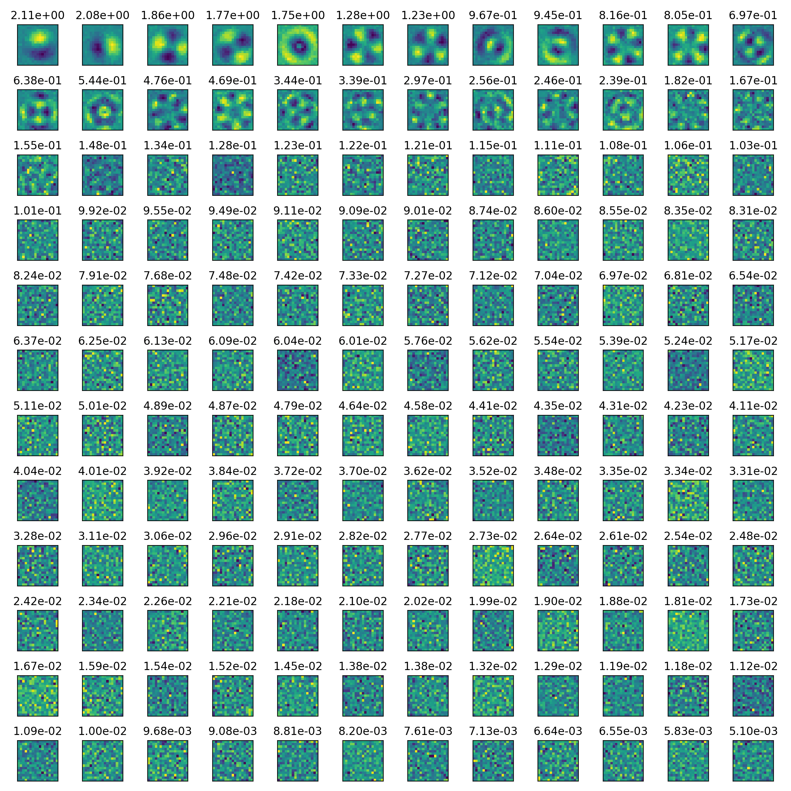
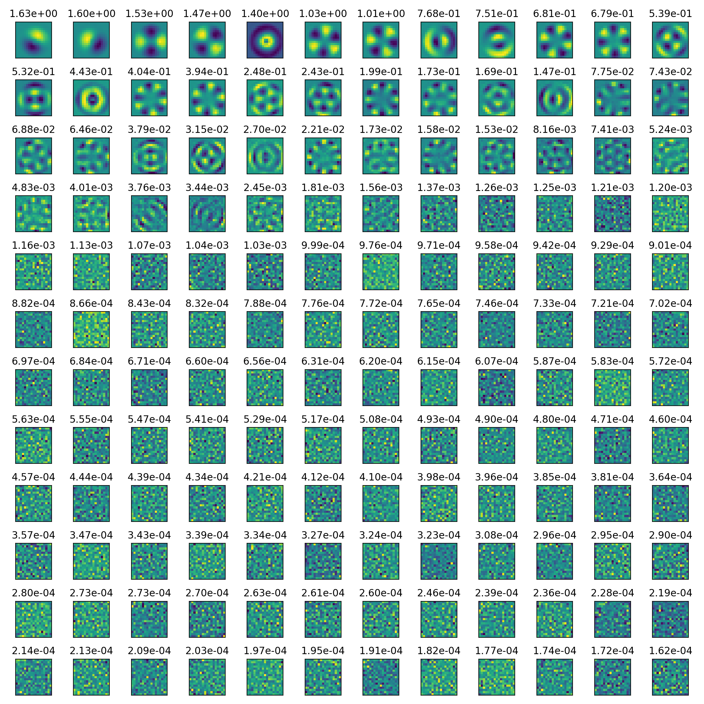
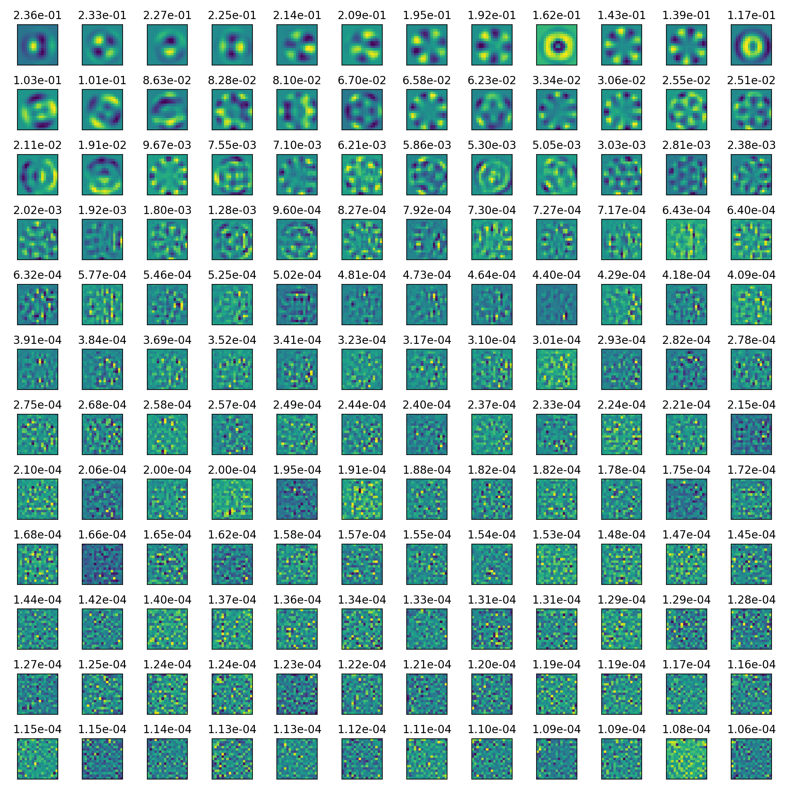

# baldr RTC

Jesse's implementation of the baldr RTC.

### RTC

Once the `baldr` executable is built, place it somewhere on your PATH (e.g., `/usr/local/bin/baldr`). See [installation](#installation) for build instructions if you run into trouble.

If you are starting `baldr` manually, you need to set the `BALDR_ROOT` environment
variable, e.g.,

```bash
export BALDR_ROOT="/usr/local/etc"
```

Then you can start `baldr` for each beam, e.g.:

```bash
# start beam 1 rtc
baldr /usr/local/etc/def1.toml --socket=tcp://localhost:6662
```

Note: If you are starting `baldr` using the `./run_scripts/run_baldr`, the BALDR_ROOT
variable will be overridden to the system setting (usually `/usr/local/etc`).

At the time of writing this (September 2026), the `baldr_jcr/defX.toml` config files
are a strict subset of the `baldr_tt/defX.toml` config files, so the `baldr_tt` ones
should be copied to `/usr/local/etc/`, and the `baldr_jcr` ones can be removed.

### Supervisor

A single python script acts as the "supervisor", allowing interaction with the
RTC using Commander and ZMQ under the hood. It's recommended to run the
supervisor script from its directory, but that may not be strictly necessary.

```bash
cd ./baldr_jcr
./supervisor.py --help
```

The `BALDR_ROOT` environment variable should be set to match the one used when
launching the RTC. In production mode, this should be:

```bash
export BALDR_ROOT=/usr/local/bin
```

The following are the main `supervisor.py` commands needed.

| argument            | description                                             | example                                      |
| ------------------- | ------------------------------------------------------- | -------------------------------------------- |
| `--init`            | reset all matrices and control variables                | `./supervisor.py 1 --init`                   |
| `--reset`           | reset control variables online                          | `./supervisor.py 1 --reset`                  |
| `--recompute`       | Do poke test, meas imat, compute cmat                   | `./supervisor.py 1 --recompute`              |
| `--poke`            | specify poke during poke test                           | `./supervisor.py 1 --recompute --poke 0.01`  |
| `--nmodes`          | specify number of modes for controller to act on        | `./supervisor.py 1 --recompute --nmodes 50`  |
| `--alpha`           | specify reconstructor regularisation param              | `./supervisor.py 1 --recompute --alpha 0.01` |
| `--navg`            | specify number of frames to avg per poke during imat    | `./supervisor.py 1 --recompute --navg 10`    |
| `--reinvert`        | compute cmat with different `--alpha` and/or `--nmodes` | `./supervisor.py 1 --reinvert --alpha 0.003` |
| `--gain` & `--leak` | set leaky integrator gain and leak                      | `./supervisor.py 1 --gain 0.3 --leak 0.99`   |
| `--open`            | open the loop immediately                               | `./supervisor.py 1 --open`                   |
| `--close`           | close the loop (using previously set gain/leak)         | `./supervisor.py 1 --close`                  |
| `--status`          | check the status of some variables (WIP)                | `./supervisor.py 1 --status`                 |

## Tuning the AO loop

The following works well in simulation, but hasn't been tested yet on-sky.

The main parameters to be tuned are (in chronological order of tuning):

- `poke` (on-bench)
- `alpha` (on-bench)
- `gain` and `leak` (on-sky)

### `poke` tuning (in lab)

1. Align the pupil and mask by eye, and apply the lab DM flat command
2. Build an interaction matrix using the following command:
   ```bash
   ./supervisor.py 1 --recompute --poke=0.01
   ```
3. Run the PCA script, and observe the displayed Figure:
   ```
   ./pca.py
   ```
4. If the first few images are not symmetric or do not look "smooth", then try
   reducing the poke. If the images look "noisy", then try increasing the poke.
   See images below for pokes that are too big, too small, and just right.

<table>
<tr><td>poke=0.005, too small</td><td>
</td>
</tr>
<tr><td>poke=0.05, just right</td><td>
</td>
</tr>
<tr><td>poke=0.2, too big</td><td>
</td>
</tr>
</table>

Note that it is also possible to increase the number of frames used per measurement
of the interaction matrix, which will have a similar effect as increasing `poke`, but
without risk of pushing into the non-linear response zone - but the SNR of the measurements
increases only with sqrt(navg), so it will take 100x as long to build an interaction
matrix with 10x the SNR, and 10000x as long to build one with 100x the SNR. Increasing
the number of frames used per interaction matrix measurement by doing (e.g.):

```bash
./supervisor.py 1 --recompute --poke=0.01 --navg=100
```

### `alpha` tuning (in lab)

1. With the displayed output of the `poke` tuning, observe the value above each
   subplot. For the "well-sensed" modes, this value will be large (around 1.0).
   For the "poorly-sensed" modes (the modes that begin to look like noise), this
   value will be significantly smaller, around 1e-4 in simulation.
2. Determine which is the last "good-looking" mode from this chart. Choose a value
   for `alpha` which is smaller than this value, but larger than most of the
   "poorly-sensed" modes.
3. Reinvert the interaction matrix with this value of `alpha`, e.g.,:
   ```bash
   ./supervisor.py 1 --reinvert --alpha=1e-4
   ```


### `gain` and `leak` (on-sky)
1. Set the `gain` and `leak` to some safe values: e.g.:
   ```bash
   ./supervisor.py 1 --gain=0.3 --leak=0.9
   ```
2. Close the loop:
   ```bash
   ./supervisor.py 1 --close
   ```
3. Observe the stability of the RTC by inspecting the DM surface (e.g., in SHM).
4. Gradually increase the gain, looking for instabilities in the DM. In simulation,
   optimal performance appears to be at around:
   ```bash
   ./supervisor 1 --gain=0.6 --leak=0.9
   ```
   Note that a higher leak will improve convergence to steady-state errors, at 
   the risk of building up bad modes. A higher gain will improve responsiveness
   and temporal performance, at the cost of increased error propagation. Increasing
   each value will reduce the viable range of the other value.


## Todo:

- [ ] replace "doubles" everywhere in RTC with singles, way overkill and should bump
      performance a little
- [ ] align datatypes in Diagram with implementation, since Diagram should be the truth "reference"

## RTC Logic


## Internal Compliance

### Data Object Implementation

| Data Object          | Diagram | c-header | servo loop | baldr | config | Commander | supervisor |
| -------------------- | :-----: | :------: | :--------: | :---: | :----: | :-------: | :--------: |
| `meas_offset_0`      |  :ok:   |   :ok:   |    :ok:    | :ok:  |  N/A   |   :ok:    |    :ok:    |
| `meas_offset_1`      |  :ok:   |   :ok:   |    :ok:    | :ok:  |  N/A   |   :ok:    |    :ok:    |
| `meas_offset_interp` |  :ok:   |   :ok:   |    :ok:    | :ok:  |  N/A   |   :ok:    |    :ok:    |
| `flux_mask`          |  :ok:   |   :ok:   |    :ok:    | :ok:  |  N/A   |   :ok:    |    :ok:    |
| `strehl_mask`        |  :ok:   |   :ok:   |    :ok:    | :ok:  |  N/A   |   :ok:    |    :ok:    |
| `meas_to_mode`       |  :ok:   |   :ok:   |    :ok:    | :ok:  |  N/A   |   :ok:    |    :ok:    |
| `filter_coeff_in`    |  :ok:   |   :ok:   |    :ok:    | :ok:  |  N/A   |   :ok:    |    :ok:    |
| `filter_coeff_out`   |  :ok:   |   :ok:   |    :ok:    | :ok:  |  N/A   |   :ok:    |    :ok:    |
| `mode_offset`        |  :ok:   |   :ok:   |    :ok:    | :ok:  |  N/A   |   :ok:    |    :x:     |
| `mode_max`           |  :ok:   |   :ok:   |    :ok:    | :ok:  |  N/A   |   :ok:    |    :x:     |
| `mode_min`           |  :ok:   |   :ok:   |    :ok:    | :ok:  |  N/A   |   :ok:    |    :x:     |
| `mode_to_com`        |  :ok:   |   :ok:   |    :ok:    | :ok:  |  N/A   |   :ok:    |    :ok:    |
| `com_max`            |  :ok:   |   :ok:   |    :ok:    | :ok:  |  N/A   |   :ok:    |    :x:     |
| `com_min`            |  :ok:   |   :ok:   |    :ok:    | :ok:  |  N/A   |   :ok:    |    :x:     |
| `com_dist_buffer`    |  :ok:   |   :ok:   |    :ok:    | :ok:  |  N/A   |   :ok:    |    :ok:    |

Note that `meas_offset_0` and `meas_offset_1` are to be interpolated between, ideally based on strehl but initially by the user. `meas_offset_0` is the startup reference, e.g., the reference obtained on-sky. `meas_offset_1` is the reference produced by a flat beam, and represents the ideal reference to be targetted.

### HRTC Pipeline

| Task                | Implemented | Tested |
| ------------------- | :---------: | :----: |
| `read_shm`          |    :ok:     |  :x:   |
| `calibrate_frame`   |    :ok:     |  :x:   |
| `compute_pol_meas`  |    :ok:     |  :x:   |
| `reconstruct_modes` |    :ok:     |  :x:   |
| `filter_modes`      |    :ok:     |  :x:   |
| `project_com`       |    :ok:     |  :x:   |
| `clip_com`          |    :ok:     |  :x:   |
| `inject_disturb`    |    :ok:     |  :x:   |
| `write_shm`         |    :ok:     |  :x:   |
