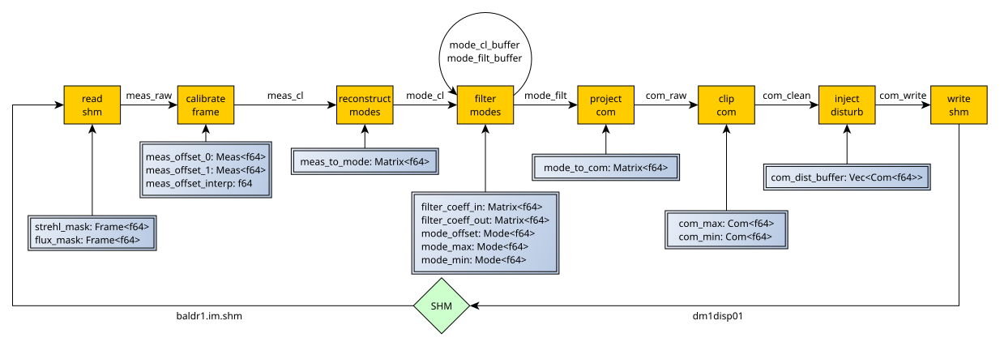

# baldr RTC

Jesse's implementation of the baldr RTC.

### RTC

Once the `baldr` executable is built, place it somewhere on your PATH (e.g., `/usr/local/bin/baldr`). See [installation](#installation) for build instructions if you run into trouble.

If you are starting `baldr` manually, you need to set the `BALDR_ROOT` environment
variable, e.g.,

```bash
export BALDR_ROOT="/usr/local/etc"
```

Then you can start `baldr` for each beam, e.g.:

```bash
# start beam 1 rtc
baldr /usr/local/etc/def1.toml --socket=tcp://localhost:6662
```

Note: If you are starting `baldr` using the `./run_scripts/run_baldr`, the BALDR_ROOT
variable will be overridden to the system setting (usually `/usr/local/etc`).

At the time of writing this (September 2026), the `baldr_jcr/defX.toml` config files
are a strict subset of the `baldr_tt/defX.toml` config files, so the `baldr_tt` ones
should be copied to `/usr/local/etc/`, and the `baldr_jcr` ones can be removed.

### Supervisor

A single python script acts as the "supervisor", allowing interaction with the
RTC using Commander and ZMQ under the hood. It's recommended to run the
supervisor script from its directory, but that may not be strictly necessary.

```bash
cd ./baldr_jcr
./supervisor.py --help
```

The `BALDR_ROOT` environment variable should be set to match the one used when
launching the RTC. In production mode, this should be:

```bash
export BALDR_ROOT=/usr/local/bin
```

If using a local simulator, you also need to explicitly set `BALDR_HOST` to `localhost`, otherwise it will use `mimir` by default.
```bash
export BALDR_HOST=localhost  # only if using a local simulator
```

Since 29 Sep 2026, the supervisor commands have been re-organised (for the 
unattainable goal of simplicity). Run `./supervisor.py --help` for more info.
An example `help` output is copied below:
```bash
$  ./supervisor.py --help

Usage: supervisor.py [OPTIONS] BEAM COMMAND [ARGS]...

  This tool is a high-layer abstraction over the Baldr RTC configuration
  intended to be used from the command line while the baldr RTC is running.
  It connects with the RTC instance via ZMQ over a pre-defined TCP socket.

Options:
  -v, --verbose  set the verbosity level
  --help         Show this message and exit.

Commands:
  cmat     build a control matrix from the interaction matrix
  ctrl     modify live RTC parameters online
  disturb  inject or disable a disturbance on the DM
  imat     construct an interaction matrix/perform a poke test
  init     initialise offline RTC parameters.
  ref      measure a reference image for the control pipeline
  status   probe and print the RTC status
```

The CLI has a similar interface to git, with subcommands that reveal more options.
For example, to modify control parameters like gain and leak, check the ctrl
subcommand:
```bash
$  ./supervisor.py 1 ctrl --help

Usage: supervisor.py BEAM ctrl [OPTIONS]

  modify live RTC parameters online

Options:
  --gain FLOAT         set the gain (must also pass leak)
  --leak FLOAT         set the leak (must also pass gain)
  --interp FLOAT       set the interpolation parameter
  --flux-thresh FLOAT  set the flux threshold
  --reset              reset all live values in the RTC
  --open               open the loop
  --close              close the loop
  --off                stop the loop
  --help               Show this message and exit.
```
so to set BEAM=3 to have gain=0.4 and leak=0.9 (for example):
```bash
./supervisor.py 3 ctrl --gain 0.4 --leak 0.9
```

## Tuning the AO loop

Instructions for tuning the AO loop can be found in a report circulated through
the team titled: `imat_pca_report_and_procedure.pdf`, which is available (at
least for now) [here](https://www.mso.anu.edu.au/~jcranney/imat_pca_report_and_procedure.pdf).

## Todo:

- [ ] move all supervisor settings to the standard commander tool rather than dedicated CLI
- [ ] replace "doubles" everywhere in RTC with singles, way overkill and should bump
      performance a little
- [ ] align datatypes in Diagram with implementation, since Diagram should be the truth "reference"

## RTC Logic



## Internal Compliance

### Data Object Implementation

| Data Object          | Diagram | c-header | servo loop | baldr | config | Commander | supervisor |
| -------------------- | :-----: | :------: | :--------: | :---: | :----: | :-------: | :--------: |
| `meas_offset_0`      |  :ok:   |   :ok:   |    :ok:    | :ok:  |  N/A   |   :ok:    |    :ok:    |
| `meas_offset_1`      |  :ok:   |   :ok:   |    :ok:    | :ok:  |  N/A   |   :ok:    |    :ok:    |
| `meas_offset_interp` |  :ok:   |   :ok:   |    :ok:    | :ok:  |  N/A   |   :ok:    |    :ok:    |
| `flux_mask`          |  :ok:   |   :ok:   |    :ok:    | :ok:  |  N/A   |   :ok:    |    :ok:    |
| `strehl_mask`        |  :ok:   |   :ok:   |    :ok:    | :ok:  |  N/A   |   :ok:    |    :ok:    |
| `meas_to_mode`       |  :ok:   |   :ok:   |    :ok:    | :ok:  |  N/A   |   :ok:    |    :ok:    |
| `filter_coeff_in`    |  :ok:   |   :ok:   |    :ok:    | :ok:  |  N/A   |   :ok:    |    :ok:    |
| `filter_coeff_out`   |  :ok:   |   :ok:   |    :ok:    | :ok:  |  N/A   |   :ok:    |    :ok:    |
| `mode_offset`        |  :ok:   |   :ok:   |    :ok:    | :ok:  |  N/A   |   :ok:    |    :x:     |
| `mode_max`           |  :ok:   |   :ok:   |    :ok:    | :ok:  |  N/A   |   :ok:    |    :x:     |
| `mode_min`           |  :ok:   |   :ok:   |    :ok:    | :ok:  |  N/A   |   :ok:    |    :x:     |
| `mode_to_com`        |  :ok:   |   :ok:   |    :ok:    | :ok:  |  N/A   |   :ok:    |    :ok:    |
| `com_max`            |  :ok:   |   :ok:   |    :ok:    | :ok:  |  N/A   |   :ok:    |    :x:     |
| `com_min`            |  :ok:   |   :ok:   |    :ok:    | :ok:  |  N/A   |   :ok:    |    :x:     |
| `com_dist_buffer`    |  :ok:   |   :ok:   |    :ok:    | :ok:  |  N/A   |   :ok:    |    :ok:    |

Note that `meas_offset_0` and `meas_offset_1` are to be interpolated between, ideally based on strehl but initially by the user. `meas_offset_0` is the startup reference, e.g., the reference obtained on-sky. `meas_offset_1` is the reference produced by a flat beam, and represents the ideal reference to be targetted.

### HRTC Pipeline

| Task                | Implemented | Tested |
| ------------------- | :---------: | :----: |
| `read_shm`          |    :ok:     |  :x:   |
| `calibrate_frame`   |    :ok:     |  :x:   |
| `compute_pol_meas`  |    :ok:     |  :x:   |
| `reconstruct_modes` |    :ok:     |  :x:   |
| `filter_modes`      |    :ok:     |  :x:   |
| `project_com`       |    :ok:     |  :x:   |
| `clip_com`          |    :ok:     |  :x:   |
| `inject_disturb`    |    :ok:     |  :x:   |
| `write_shm`         |    :ok:     |  :x:   |
